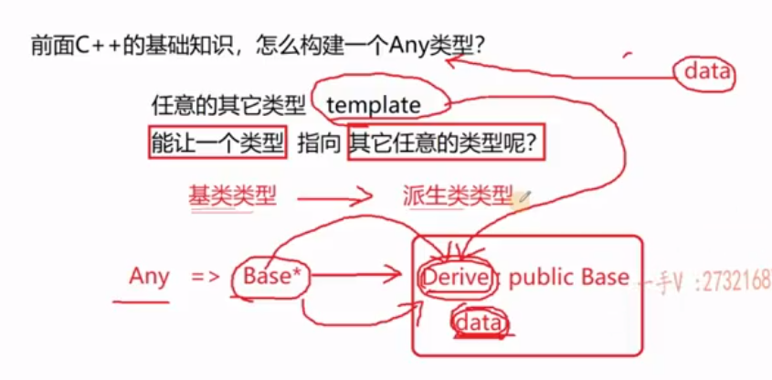
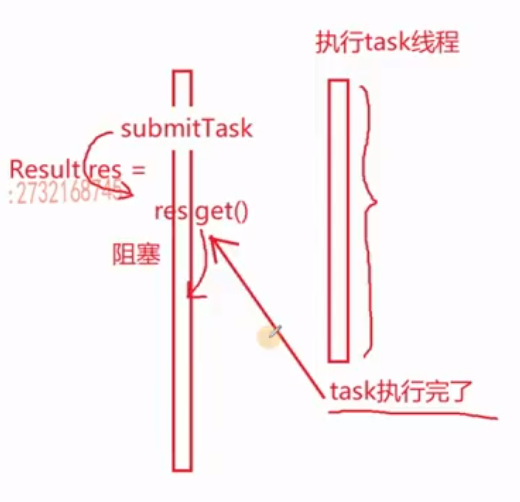
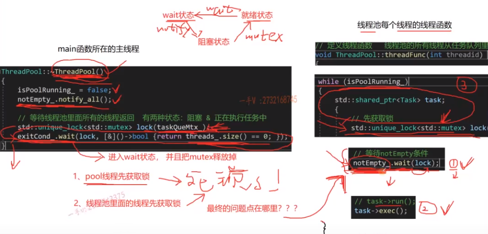

## 问题准备

### **:rocket: 并发与并行有何区别？**

- 单核上，多个线程占用该CPU的不同时间片，通过CPU调度算法实现不同任务间的切换，但**物理上还是串行执行的**。由于每个线程占用的CPU时间片非常短，看起来就像是多个线程都在共同执行一样，这样的场景称作并发(concurrent)
- 在多CPU上，不同的CPU执行不同的任务，在一个任务完成之前不存在与其他任务在同一CPU上的切换，**实现多个任务真正同时进行**，这样的场景称作并行(parallel)

### **:rocket: 线程越多越好吗？为什么？**

- **IO密集型：程序里面的指令涉及IO操作，例如设备、文件、网络操作等；CPU密集型：程序中的指令都是做计算用的**
- 线程不是越多越好，需要结合具体的应用场景分析：对于IO密集型程序，由于**IO密集型程序在等待输入输出操作或客户端连接时可以阻塞程序，所以最好使用多线程**。对于CPU密集型程序，若当前运行环境为多核，使用多线程可以加快运行速度；**若当前运行环境为单核，使用多线程反而会降低运行速度，因为线程的切换、栈内存的恢复也需要消耗资源，此时最好使用单线程**
- 线程的创建与销毁都需要消耗资源，例如用户空间到内核空间的切换、线程的内核栈的创建、页表与页目录的创建、描述进程的地址空间的数据结构的初始化等，线程越多，这些资源消耗越大。**因此尽量不要在服务的过程中实时地创建或销毁线程**。线程的切换也需要消耗资源，例如线程的上下文切换、线程的调度等，线程越多，这些资源消耗越大，进而导致CPU的利用率下降
- 当创建线程之后，**线程函数所在的线程栈需要共享当前所在进程的用户空间(3G)**，此时若创建大量的线程(大约最多可创建380个线程)，会导致内存空间不足，从而导致程序崩溃。若大量线程同时被唤醒会使系统出现锯齿状负载或者瞬间负载量很大，导致宕机
- 一般在使用过程中，线程数量是依据当前运行系统下的CPU核心数(`hardware_concurrency()`函数)来确定的，例如CPU核数为4，则线程数量一般为4

### **:rocket: 谈一下你了解的多线程/多进程编程**

- 多线程编程：在一个进程中创建多个线程，每个线程执行不同的任务，从而实现多任务并行执行的效果
- 多进程编程：在一个进程中创建多个子进程，每个子进程执行不同的任务，从而实现多任务并行执行的效果
- 在Linux操作系统下可以调用`fork`函数创建子进程，也可以调用`pthread_create`函数创建子线程；而在C++语言中，自C++11才开始推出了多线程库，现在一般使用`std::thread`类创建子线程
- **在Linux操作系统下，进程间同步方式大致可以分为两大类：管道(有名/无名)、socket套接字、消息队列、共享内存共四种通信方式，信号量、互斥锁、信号共三种互斥方式**
- **共享内存：多个进程共享一段内存，进程间通讯最快的方式**，但是没有同步机制，需要自己实现；把这段内存空间映射到多个进程(有无血缘关系均可)，某一进程对这段内存的操作都会影响到其他进程；常用函数：创建共享内存、建立映射关系、解除映射关系、删除共享内存
- **消息队列：是一种以结构体为载体的数据容器**；消息队列是一个消息链表，存放在内核中，可以实现进程间(有无血缘关系均可)的通信；常用函数：创建消息队列、发送消息、接收消息、删除消息队列
- **信号量：是一个由内核维护的>=0的整数，用来表示某种资源的数量**，具有排他性，可以用来实现进程间的互斥
- **无名信号量：是一个计数器，用来控制多个进程对共享资源的访问**；信号量是一个整数，用来表示某种资源的数量，可以用来实现进程间的互斥；常用函数：创建信号量、初始化信号量、P操作、V操作、删除信号量
- 互斥锁：可以理解为只能加锁或解锁的信号量；更多的用在线程之间的同步，而不是进程之间的同步；互斥锁是一个结构体，用来实现进程间的同步；常用函数：创建互斥锁、初始化互斥锁、加锁、解锁、删除互斥锁
- **信号：内核与应用进程之间或应用程序与应用程序之间传递控制的命令，而不是传递数据**；信号是一种异步通知机制，可以用来实现进程间的同步；常用函数：发送信号、捕捉信号、忽略信号
- **C++语言中，线程间同步的方式大致可分为互斥与通信两种，互斥指的是多个线程执行同一段代码，但不能同时执行，通信指的是不同线程执行不同的代码，彼此之间有条件依赖。互斥锁`mutex`类、`atomic`原子类型用于实现线程互斥(多个线程运行同一段代码)，条件变量`condition_variable`类、信号量`semaphore`(C++20)用于实现线程通信(多个线程运行各自的相互联系的代码)**
- 线程通信中，条件变量`condition_variable`与互斥锁`mutex`配合使用，控制更加精细；**信号量`semaphore`可以看作是资源计数没有限制的互斥锁`mutex`，只能粗略控制执行的先后顺序，对于具有竟态条件的代码段无法实现原子操作(关键原因是资源计数没有限制)**
- 还有一种二元信号量`semaphore`，可以看作是资源计数只能为0或1的互斥锁`mutex`，可以完成和`mutex`互斥锁同样的线程互斥操作。**二者的区别在于：`mutex`只能由加锁的线程解锁，而发布信号量`post()`成员函数、等待信号量`wait()`成员函数都可以由任意线程调用，可能会存在一个线程还未执行完毕另一个线程就又获得了资源计数，所以还是具有信号量无法实现原子操作的固有缺点**

### **:rocket: 多线程专业术语汇总**

- 一段代码能否在多线程环境下执行，取决于这段代码是否存在竟态条件
- 竟态条件：多个线程同时访问同一块资源，且最终的结果取决于线程执行的顺序
- 如果在多线程环境下不存在竟态条件，则是多线程可重入(一个线程没有运行完另一个线程又调用)的；反之是不可重入的
- **临界区：多个线程同时访问的共享资源，且存在竟态条件的代码段，需要用到线程互斥方法保证其原子操作**
- 对于存在竟态条件但比较简单的代码段，可以不使用互斥锁，而使用原子类型`atomic`来实现线程互斥，效率更高
- **分析多线程问题时，绝对不能假设线程的运行时序，但可以在逻辑上要求运行的先后顺序**

### **:rocket: 描述一下生产者消费者模型**

- **生产者消费者模型是C++多线程通信模型中的典型案例**，具体使用场景可以分为先生产后消费或生产一个消费一个两种
- 在这个模型中，生产者与消费者均使用`unique_lock`**模板类**(该类提供了`lock`与`unlock`成员函数，不能使用`lock_guard`类)与互斥锁`mutex`配合使用创建互斥量，通过`condition_variable`类创建条件变量
- 当生产者生产完毕后，通过条件变量的`notify_all`方法通知消费者；当消费者消费完毕后，通过条件变量的`wait`方法等待生产者通知
- 执行`wait`函数时，**线程会先把互斥锁释放，因此不会造成死锁现象，同时线程状态由`running`变为`waiting`**，并且等待条件变量的通知；当收到通知后，线程状态由`waiting`变为`blocking`，**此时若互斥锁已被解锁，线程状态才有可能(取决于接下来线程的执行顺序)会由`blocking`变为`running`，继续执行，否则将继续阻塞在此处**
- 类似的，执行`notify_all`或`notify_one`函数时，线程只是发出通知，此时有没有其他线程接收并不重要，**接收到通知的线程只是从`waiting`状态变为`blocking`状态，一般要等待线程函数运行完毕，自动调用析构函数释放互斥锁之后，接收到通知的线程状态才有可能(取决于接下来线程的执行顺序)由`blocking`变为`running`，继续执行**
- **在本项目中，用户是任务的生产者，线程是任务的消费者，不同的线程(用户线程、线程池线程)读取同一个任务队列，需要考虑任务队列(STL容器)的线程安全问题**

### **:rocket: 该项目的应用场景有哪些，为什么有这个需求**

- 在服务进程启动之初，就事先创建好线程池里面的线程，当业务流量到来时需要分配线程，直接从线程池中获取一个空闲线程执行 task 任务即可，task 执行完成后，**也不用释放线程，而是把线程归还到线程池中继续给后续的 task 提供服务**，这样就避免了线程的实时频繁创建与销毁，提高了程序的性能
- 同时线程池也最大化利用了硬件多核的优势
- fixed 模式下：**线程池里面的线程个数是固定不变的**，一般是ThreadPool创建时根据当前机器的CPU核心数量进行指定
- cached 模式下：**线程池里面的线程个数是可动态增长的**，根据任务的数量动态地增加线程的数量，但是**会设置一个线程数量的阈值(线程过多的坏处上面已经讲过了)，任务处理完成，如果动态增长的线程空闲了60s还没有处理其它任务，那么关闭线程、保持池中最初数量的线程即可**

### **:rocket: 项目中用到了哪些重要知识点**

- 任务队列(std::queue)中存放的是`shared_ptr`智能指针，可以避免用户传入一个匿名的任务对象，导致任务队列中存储的任务对象被提前销毁，进而导致的内存泄漏问题
- 用户使用时需要继承`Task`基类实现自定义的任务类，并在其中重写`run`纯虚函数，这样就可以实现用户自定义的线程操作；线程池中存放任务的队列(std::queue)具体**存放的是基类类型的智能指针**，这样用户在使用时，可以让该智能指针指向派生类的对象；**调用时编译器将根据智能指针所指向的派生类的对象类型，调用不同的虚函数，从而实现多态**
- **因为各线程函数在执行时要保证竟态条件**，所以也需要用到互斥锁与条件变量，因此将具体的线程函数`threadFunc()`定义在`ThreadPool`类中；**在创建线程对象时，调用标准库函数`bind()`，生成一个可调用线程函数`threadFunc()`的匿名可调用对象，传递给`Thread`类的构造函数**，`make_unique()`函数生成指向`Thread`类对象的智能指针，从而实现线程的创建
- **为了使程序可以接收线程函数的返回值**，用C++11语言标准实现了`run()`函数的返回值`Any`类型，具体实现时参考Java语言中的Object类型的实现、使用了模板类与多态的结合。**`Any`类中包含具有继承关系的类型，其成员变量就是基类类型的智能指针，派生类又使用了类模板实现其构造函数，这样就可以实现`Any`类型指向其他任意类型**，而具体的数据包含在派生类中。其中实现了两个成员函数，一个用于接收任意类型构造Any类型的对象，一个用于提取Any对象之中存储的数据。这里其实是委托设计思想：一个类中含有指向另一个类的指针，这样就可以调用另一个类的成员函数(注意模板类的实现也需要放在头文件中)

- **为了实现用户提取返回结果的主线程与执行任务的子线程之间的通信**，在C++11语言标准中，借助互斥锁与条件变量，**成员变量中增加了一个表示资源计数的整形常量**，手动实现了`Semaphore`类

- 为了实现接收提交到线程池的task任务执行完成之后的返回值，定义`Result`类型。**`Task`基类与`Result`类进行耦合，实现了任务与对应返回值的绑定**，`Result`类中含有`Task`基类类`shared_ptr`智能指针的成员变量，是为了知道获取哪个任务的返回值；`Task`基类中含有指向`Result`类的裸指针，是为了把任务的返回值传递给`Result`类，从而实现用户获取任务返回值的功能。使用裸指针也是为了避免循环引用
- **`ThreadPool`类中，既有线程数量上限阈值`threadSizeThresHold_`，防止面对大量突发任务时无限制地创建线程而把用户空间占满；又有任务数量上限阈值`taskQueMaxThresHold_`，防止某些任务执行比较耗时而阻塞用于提交任务，即任务过多时会提示用户任务提交失败**。这两个变量都不需要修改，因此不需要限定原子操作
- 右值引用、移动语义、智能指针、STL容器、互斥锁、条件变量、可变参函数模板

### **:rocket: 项目中出现的问题有哪些，如何解决**

- 在线程池析构时，需要考虑三种情况：**正在等待获取任务的线程(`notEmpty_.wait(lock)`)、正在执行任务的线程(`task->exec()`)、已执行完任务但由于没有抢到互斥锁而没有进入等待获取任务的线程**，前两种情况比较好处理，对于第三种情况，**当用户线程调用`ThreadPool`类的析构函数先抢到互斥锁`taskQueMtx_`时，`notEmpty_`一直处于 waiting 状态，导致死锁；当线程池中的线程先抢到互斥锁`taskQueMtx_`，`exitCond_`一直处于 waiting 状态，也会导致死锁问题**

- 修改方法是交换`std::unique_lock<st::mutex> lock(taskQueMtx_)`与`notEmpty_.notify_all()`语句，这样可以保证当剩余的线程再次进入`notEmpty_wait(lock)`时还能被唤醒
- 当线程池`ThreadPool`类的对象析构时，**需要等待任务全部执行完成再结束线程**，因此线程函数`threadFunc()`中的`for`循环是一个死循环，当任务队列不空时就执行任务，当任务队列为空时，首先检测`isPoolRunning_`标志位，若为`false`，则说明线程池要结束，回收线程资源；若为`true`，则说明线程池不结束，继续等待任务队列不空，执行任务

```C++
// 线程池析构
ThreadPool::~ThreadPool()
{
    isPoolRunning_ = false;

    // 等待线程池中的所有线程返回，此时线程有两种状态：等待获取任务 & 正在执行任务中
    std::unique_lock<std::mutex> lock(taskQueMtx_); // 绑定互斥锁的智能锁
    notEmpty_.notify_all(); // waiting --> blocking
    exitCond_.wait(lock, [&]()->bool{return threads_.size() == 0; });
}

// 线程函数：线程池中的线程从任务队列中消费任务(消费者)
void ThreadPool::threadFunc(int threadId) // 线程函数返回，相应的线程也就结束了！！！
{
	 // std::cout << "Begin with threadFunc tid: " << std::this_thread::get_id() << std::endl;
	 // std::cout << "End with threadFunc tid: " << std::this_thread::get_id() << std::endl;

	auto lastTime = std::chrono::high_resolution_clock().now();

	// 所有任务必须执行完成，线程池才可以回收所有线程资源
    // 而不是线程池析构时就立刻回收所有线程资源，所以还是用for循环
	// 当任务队列为空时才判断线程池是否析构
	// 必须是死循环保证所有任务全部被执行完成，线程才能回收
	for (; ; ) // 不断消费任务，所以是一个死循环
	{
		std::shared_ptr<Task> task;

		// 为了保证线程取得任务后就解锁，所以需要再开一个代码段，否则其他线程需要等待该线程执行完任务后才能获取锁
		// 当代码段结束时，锁就会被unique_lock模板类的析构函数释放
		{
			// 获取锁，任务队列是临界区代码段，存在竟态条件
			// 在unique_lock模板类的构造函数中，就会调用lock()成员函数对互斥锁taskQueMtx_进行加锁
			// 必须使用unique_lock模板类，而不能使用lock_guard模板类，因为后者不存在lock()与unlock()成员函数
			std::unique_lock<std::mutex> lock(taskQueMtx_);

			std::cout << "tid: " << std::this_thread::get_id() << "尝试获取任务..." << std::endl;
			
			// Q：每一秒钟返回一次。如何区分超时返回与有任务待执行返回？A：锁 + 双重判断(线程安全的单例模式)
			// 只要有任务没有执行完成，就不会进入循环，必须等任务全部执行完才能回收线程资源
			while (taskQue_.size() == 0)
			{
				// 线程池要结束，回收原来等待获取任务的线程资源
				if (!isPoolRunning_)
				{
					// 线程池要结束，回收线程资源
					threads_.erase(threadId); // 注意不要传入std::this_thread::get_id()
					std::cout << "Thread: " << std::this_thread::get_id() << " exit!" << std::endl;
					exitCond_.notify_all();
					return; // 线程函数结束就是线程结束
				}

				// cached模式下，有可能已经创建了很多线程但空闲时间超过60s，在保证初始线程数量的基础上应该回收多余线程
				// “很多”：超过initThreadSize_; “空闲时间”：当前时间 - 上次线程执行时间
				if (poolMode_ == PoolMode::MODE_CACHED)
				{
					// 条件变量，超时返回。成员函数wait_for()返回值为timeout/no_timeout，前者表示超时，后者表示未超时
					if (std::cv_status::timeout == notEmpty_.wait_for(lock, std::chrono::seconds(1)))
					{
						auto nowTime = std::chrono::high_resolution_clock().now();
						auto dur = std::chrono::duration_cast<std::chrono::seconds>(nowTime - lastTime); 
						// 作差只会得到周期数，还要转化为时间格式
						if (dur.count() >= THREAD_MAX_IDLE_TIME
							&& curThreadSize_ > initThreadSize_) // 在保证初始线程数量的基础上回收线程
						{
							// 回收当前线程：把线程对象从线程容器中删除，修改与线程数量相关的变量
							// 如何把线程和线程ID对应起来，这里就要将存储线程的容器从vector改为unordered_map
							threads_.erase(threadId); // 注意不要传入std::this_thread::get_id()
							curThreadSize_--;
							idleThreadSize_--;

							std::cout << "Thread: " << std::this_thread::get_id() << " exit!" << std::endl;
							return; // 线程函数返回，线程结束
						}
					}
				}
				else // Fixed模式，当任务队列为空时等待用户提交任务
				{
					// 多线程通信，同时等待任务队列不空。一旦发现不空，但只能有一个线程抢到锁
					notEmpty_.wait(lock);
				}
				
				// 线程池要结束，回收原来等待获取任务的线程资源
				//if (!isPoolRunning_)
				//{
				//	threads_.erase(threadId); // 注意不要传入std::this_thread::get_id()

				//	std::cout << "Thread: " << std::this_thread::get_id() << " exit!" << std::endl;
				//	exitCond_.notify_all();
				//	return; // 线程函数结束就是线程结束
				//}
			}

			idleThreadSize_--; // 线程开始执行任务，空闲线程的数量减少

			std::cout << "tid: " << std::this_thread::get_id() << "获取任务成功..." << std::endl;

			// 如果队列不空，从队列中取出任务
			task = taskQue_.front(); // std::shared_ptr<Task> task = taskQue_.front();
			taskQue_.pop();
			taskSize_--;

			// 如果队列中依然有剩余任务，继续通知其他线程执行任务
			if (taskQue_.size() > 0)
			{
				notEmpty_.notify_all();
			}

			// 因为新消费了任务，队列肯定不满。在notFull_上进行通知可以用户提交/生产任务
			notFull_.notify_all(); // 这里就能明显地感受到使用两个条件变量的好处
		} // 从队列中取出任务之后就应该解锁，否则如果当前任务比较耗时，则线程会发生阻塞
		
		// 当前线程负责执行任务，任务的执行不能包含在加锁的范围内，否则其他线程也不能消费任务
		if (task != nullptr)
		{
			// 执行任务，把任务的返回值通过setVal方法给到Result
			// task->run(); // 继承与多态，根据基类指针所指向的具体派生类对象，调用具体对象的重写成员函数
			task->exec(); // 这里的设计相当于又多套一层
		}

		idleThreadSize_++; // 线程执行任务完成，空闲线程的数量又增加
		lastTime = std::chrono::high_resolution_clock().now(); //更新线程执行完任务的时间
	}

	// 线程池要结束，回收原来正在实行任务中的线程资源
	// threads_.erase(threadId);
	// std::cout << "Thread: " << std::this_thread::get_id() << " exit!" << std::endl;
	// exitCond_.notify_all();
}
```
- 另外，当在Linux系统上编译成动态链接库时也会发生死锁问题，主要原因**在于`g++`中对于`condition_variable`类的析构函数中并没有回收资源**；因此需要在自定义的`Semaphore`类中加入一个标识是否退出的原子类型布尔变量`isExit_`，一旦该变量为`true`，直接返回不再进行 waiting
```C++
// 实现一个信号量类
class Semaphore
{
public:
	// 构造函数
	Semaphore(int limit = 0) 
		: resLimit_(limit)
		, isExit_(false)
		{} // 可以在初始化时指定资源计数
	// 析构函数
	~Semaphore()
	{
		isExit_ = true;
	}

	// 获取一个信号量资源
	void wait()
	{
		if (isExit_) // 资源已经销毁，不要继续等待
			return;
		std::unique_lock<std::mutex> lock(mtx_);
		// 等待信号量有资源，没有资源的话会阻塞当前线程
		cond_.wait(lock, [&]() ->bool { return resLimit_ > 0; });
		resLimit_--;
	}

	// 增加一个信号量资源
	void post()
	{
		if (isExit_) // 资源已经销毁，不要继续等待
			return;
		std::unique_lock<std::mutex> lock(mtx_);
		resLimit_++;
		// 在Linux系统上，condition_variable的析构函数什么也没做
		// 导致这里状态已经失效，无故阻塞
		cond_.notify_all();
	}
	// 可以在不同线程中获取资源或增加资源，这是与互斥锁的最本质区别
private:
	std::atomic_bool isExit_; // 表示资源是否还存在的标志位
	int resLimit_; // 资源计数，因为信号量可看作是资源计数无限制的互斥锁
	std::mutex mtx_;
	std::condition_variable cond_;
	// 互斥锁与条件变量都是类类型，注意不是模板类
};
```

### **:rocket: Linux命令**

- 编译链接：
```C++
g++ -fPIC -shared threadpool.cpp -o libtdpool.so -std=c++17
mv threadpool.so /usr/local/lib/
rm threadpool.cpp
mv threadpool.h /usr/local/include/
g++ test.cpp -std=c++17 -ltdpool -lpthread
ls
cd /etc/ld.so.conf/
nano mylib.conf
/usr/local/lib
ldconfig
```
- 调试：
```C++
su root // 切换到root用户
ps -u // 查看当前用户的进程与PID号
gdb attach PID // 启动GDB调试
info threads // 显示线程信息
bt // 打印线程堆栈
```

### **:rocket: 完整地介绍本项目**

- 首先是项目的应用背景：线程池一方面通过事先创建好线程，当业务流量到来时直接分配空闲线程执行任务即可；当前任务执行完成后，也不释放线程，而是把线程归还到线程池中继续等待执行后续任务，**这样就避免了线程的实时频繁创建与销毁，提高了程序的性能。另外一方面线程池也可以最大化利用了硬件多核的优势，防止IO密集型程序阻塞用户主线程**
- 其次是项目的基本设计思路：项目的大体框架是应用了多线程通信中的生产者消费者模型，用户可看作是任务的生产者，线程可看作是任务的消费者，因此在这个过程中需要使用模板类`unique_lock`、互斥锁`mutex`与条件变量`condition_variable`保证任务队列的线程安全性
- 线程池可以根据用户需要进行 fixed 模式与 cached 模式的定制，在 fixed 模式下：**线程池里面的线程个数是固定不变的**，一般是ThreadPool创建时根据当前机器的CPU核心数量进行指定，调用`hardware_concurrency()`函数；在 cached 模式下：**线程池里面的线程个数是可动态增长的**，根据任务的数量动态地增加线程的数量，但是**会设置一个线程数量的阈值(线程过多的坏处上面已经讲过了)，任务处理完成，如果动态增长的线程空闲了60s还没有处理其它任务，那么关闭线程、保持池中最初数量的线程即可**
- 接着是项目用到的关键技术：**STL容器**：unordered_map 管理线程对象，创建线程ID与指向线程的智能指针之间的映射关系；queue 管理任务对象，根据任务提交的先后顺序依次执行。**智能指针**：在unordered_map 与 queue 中都用到了，指向可能传入的匿名线程对象或匿名任务，防止内存泄漏。**unique_lock 模板类、互斥锁、条件变量**：实现线程同步，保证任务队列的竟态条件；具体的线程函数定义在`ThreadPool`类中；在创建线程对象时，调用标准库函数`bind()`，生成一个可调用线程函数`threadFunc()`的匿名可调用对象，传递给`Thread`类的构造函数，`make_unique()`函数生成指向`Thread`类对象的智能指针，从而实现线程的创建。**右值引用、移动语义**：实现线程池的移动构造函数；**可变参函数模板**：实现线程函数的可变参；**继承与多态**：在线程池源文件中定义纯虚基类，用户可继承这个类实现自定义功能函数
- 为了可以实现接收`run()`函数的返回值，需要在`Task`类中增加一个`Result`类的成员变量，该类中存储了`Any`类型的成员变量，通过裸指针再调用`Result`类的成员方法，获取返回类型；`Result`类中的`Task`类成员变量使用了`shared_ptr`智能指针，这也是为了知道获取哪个任务的返回值
- 然后是我在项目中遇到的问题：
- 最后是项目可能的改进方向：可以为不同的任务添加优先级标签，在 fixed 模式下当出现多任务争抢线程时，优先执行优先级较高的任务